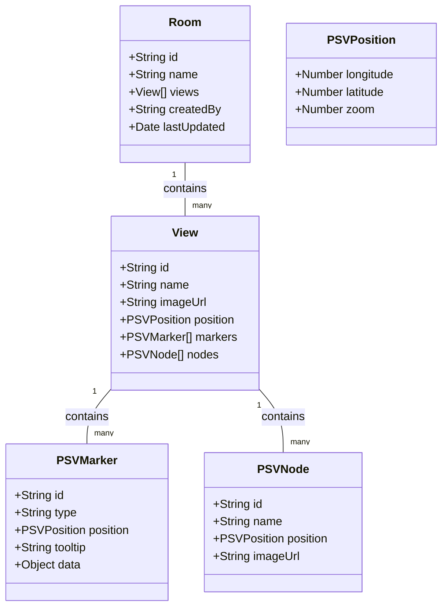
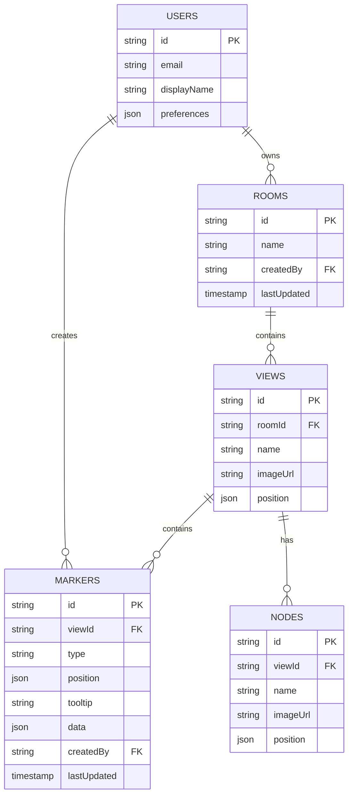
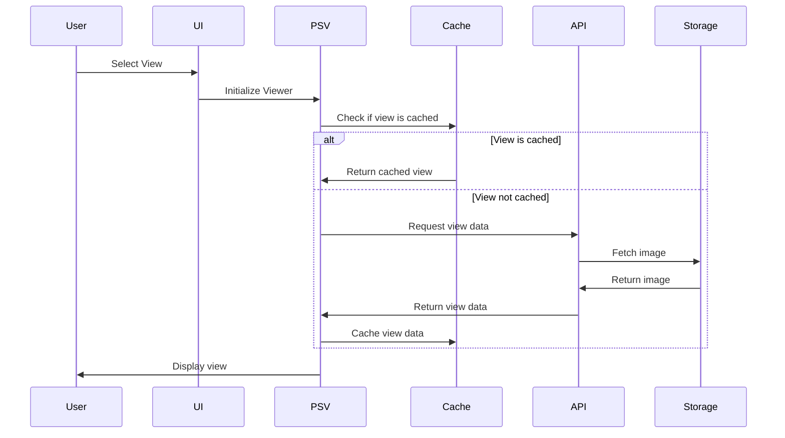

# Kitchen 360° Organizer - Architecture Guide

## System Architecture

### Overview
The Kitchen 360° Organizer is built as a modern web application with a React frontend and cloud-based backend services. The architecture follows a modular, component-based design pattern with clear separation of concerns, leveraging Photo Sphere Viewer's official plugins for core functionality.

### Frontend Architecture

#### Core Components
1. **Viewer Component**
   - Uses `@photo-sphere-viewer/core` for base 360° image rendering
   - Implements `@photo-sphere-viewer/plugin-markers` for hotspot management
   - Uses `@photo-sphere-viewer/plugin-gallery` for view transitions
   - Implements `@photo-sphere-viewer/plugin-visible-range` for performance
   - Uses `@photo-sphere-viewer/plugin-zoom` for zoom controls

2. **View Navigation System**
   - Leverages `@photo-sphere-viewer/plugin-gallery` for view management
   - Uses `@photo-sphere-viewer/plugin-virtual-tour` for view connections
   - Implements `@photo-sphere-viewer/plugin-minimap` for spatial awareness
   - Uses `@photo-sphere-viewer/plugin-compass` for orientation

3. **Hotspot System**
   - Uses `@photo-sphere-viewer/plugin-markers` for hotspot visualization
   - Implements custom marker types for different storage types
   - Uses `@photo-sphere-viewer/plugin-tooltip` for hotspot information
   - Leverages `@photo-sphere-viewer/plugin-visible-range` for performance

4. **Modal System**
   - Uses `@photo-sphere-viewer/plugin-markers` for hotspot interaction
   - Implements custom modal for content management
   - Uses `@photo-sphere-viewer/plugin-tooltip` for quick previews

5. **Editor Interface**
   - Uses `@photo-sphere-viewer/plugin-markers` for hotspot placement
   - Implements `@photo-sphere-viewer/plugin-virtual-tour` for view connections
   - Uses `@photo-sphere-viewer/plugin-visible-range` for performance

### Backend Architecture

#### Data Models

#### Database Structure

### View Management System

### Plugin Integration

### State Management

### Security Considerations

### Performance Optimization

### Deployment Architecture

### Future Considerations

## Development Guidelines

### Code Style
- Follow TypeScript best practices
- Use functional components with hooks
- Implement proper error handling
- Write comprehensive tests

### Testing Strategy
- Unit tests for components
- Integration tests for features
- End-to-end testing
- Performance testing
- View transition testing

### Documentation
- Component documentation
- API documentation
- Setup guides
- Troubleshooting guides 