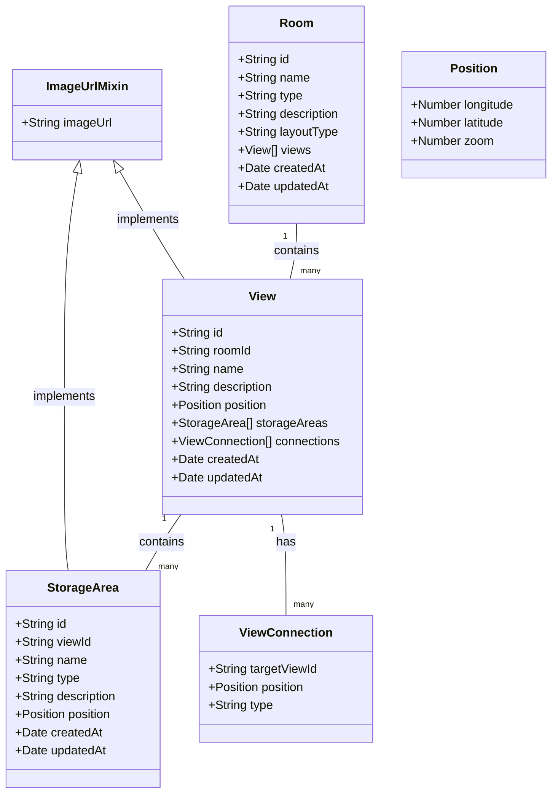
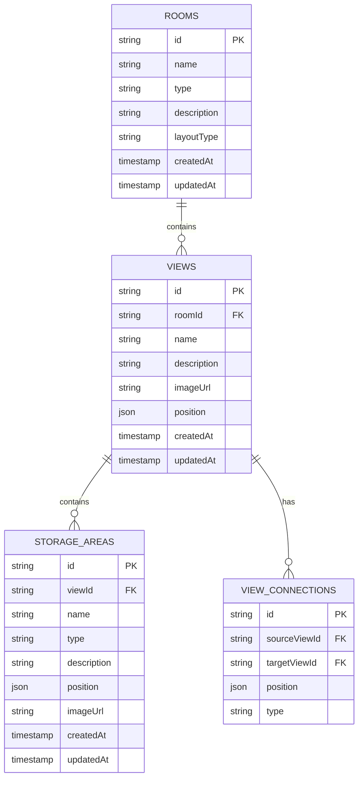
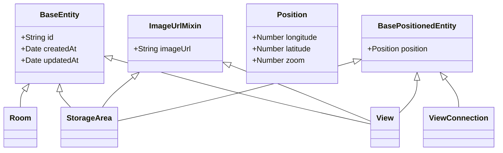

# Data Models

## Entity Relationships

## Database Structure

## Type System

## Storage Area Types
- Cabinet
- Drawer
- Shelf
- Custom

## View Connection Types
- Door
- Archway
- Opening
- Custom

## Data Flow

### Room Creation
1. User inputs room details
2. System validates input
3. Room is created in database
4. Room ID is returned
5. User proceeds to view creation

### View Creation
1. User uploads 360° image
2. System processes and stores image
3. User inputs view details
4. System validates input
5. View is created in database
6. View ID is returned
7. Optional: User creates view connections

### Storage Area Creation
1. User selects position in view
2. User uploads storage area image
3. System processes and stores image
4. User inputs storage area details
5. System validates input
6. Storage area is created in database
7. Storage area ID is returned
8. Marker is added to view

## Validation Rules

### Room Validation
- Name: Required, 2-100 characters
- Type: Required, must be valid room type
- Description: Optional, max 500 characters
- Layout Type: Required, must be valid layout type

### View Validation
- Name: Required, 2-100 characters
- Description: Optional, max 500 characters
- Image: Required, must be valid 360° image
- Position: Required, valid coordinates

### Storage Area Validation
- Name: Required, 2-100 characters
- Type: Required, must be valid storage type
- Description: Optional, max 500 characters
- Position: Required, valid coordinates
- Image: Required, valid image format 