# System Flows

## View Management System

## Room Creation Flow

## View Creation Flow

```mermaid
sequenceDiagram
    participant User
    participant UI
    participant API
    participant Storage
    participant DB

    User->>UI: Upload 360° Image
    User->>UI: Enter View Details
    UI->>UI: Validate Input
    UI->>Storage: Upload Image
    Storage-->>UI: Return Image URL
    UI->>API: Create View Request
    API->>DB: Save View Data
    DB-->>API: View Created
    API-->>UI: Return View ID
    UI-->>User: Show Success

    opt Add View Connections
        User->>UI: Select Target View
        User->>UI: Set Connection Position
        UI->>API: Create Connection
        API->>DB: Save Connection
        DB-->>API: Connection Created
        API-->>UI: Update Success
    end
```

## Storage Area Creation Flow

## Image Management Flow

## Error Handling Flows

### Image Upload Error
1. User attempts to upload image
2. System validates image
3. If validation fails:
   - Show error message
   - Allow retry
   - Provide format requirements
4. If upload fails:
   - Show error message
   - Allow retry
   - Provide troubleshooting steps

### Position Selection Error
1. User attempts to select position
2. System validates position
3. If validation fails:
   - Show error message
   - Highlight invalid area
   - Provide guidance for valid positions

### Data Validation Error
1. User submits form
2. System validates data
3. If validation fails:
   - Show error messages
   - Highlight invalid fields
   - Provide correction guidance
4. User corrects errors
5. System revalidates
6. Process continues if valid

## Performance Optimization Flows

### View Loading
1. User requests view
2. System checks cache
3. If cached:
   - Load from cache
   - Show loading indicator
   - Display when ready
4. If not cached:
   - Show loading indicator
   - Fetch from server
   - Cache response
   - Display when ready

### Image Loading
1. System detects image in viewport
2. Check if image is cached
3. If cached:
   - Load from cache
   - Show placeholder
   - Display when ready
4. If not cached:
   - Show placeholder
   - Fetch from server
   - Cache response
   - Display when ready 