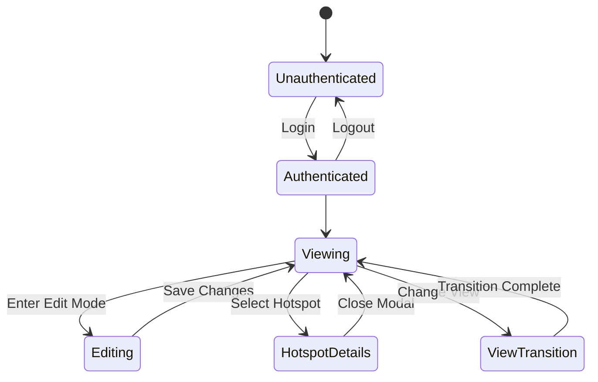
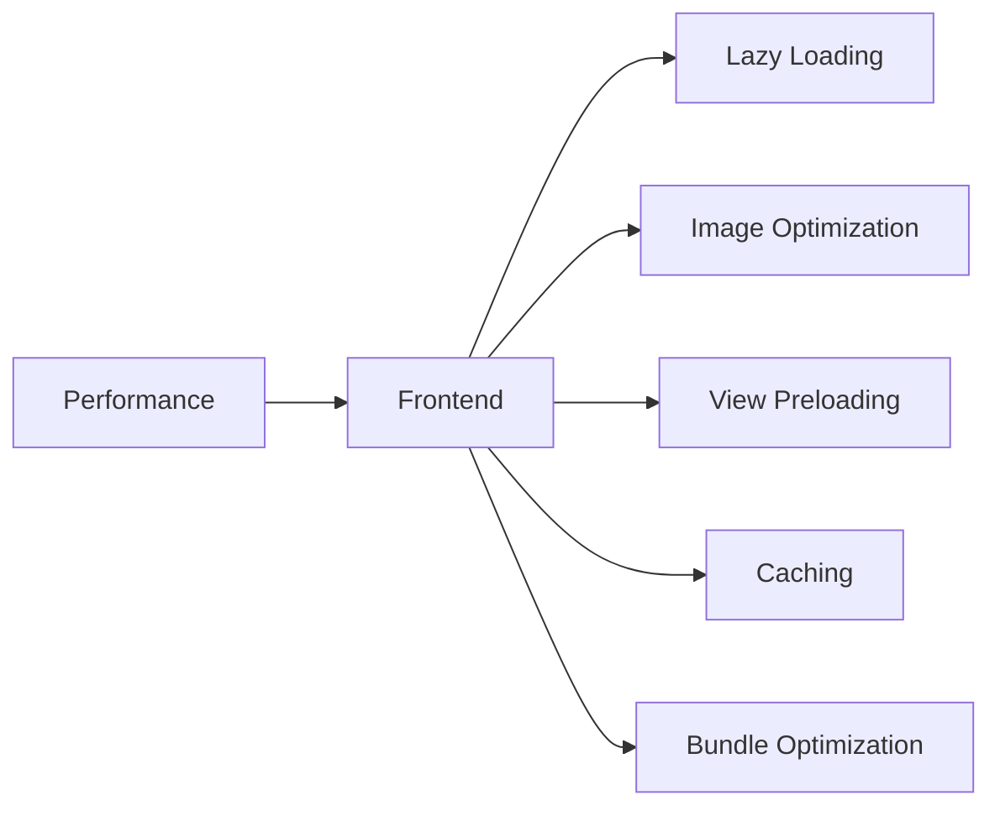

# Frontend Architecture

## Core Components

### Viewer Component
- Uses `@photo-sphere-viewer/core` for base 360° image rendering
- Implements `@photo-sphere-viewer/plugin-markers` for hotspot management
- Uses `@photo-sphere-viewer/plugin-gallery` for view transitions
- Implements `@photo-sphere-viewer/plugin-visible-range` for performance
- Uses `@photo-sphere-viewer/plugin-zoom` for zoom controls

### View Navigation System
- Leverages `@photo-sphere-viewer/plugin-gallery` for view management
- Uses `@photo-sphere-viewer/plugin-virtual-tour` for view connections
- Implements `@photo-sphere-viewer/plugin-minimap` for spatial awareness
- Uses `@photo-sphere-viewer/plugin-compass` for orientation

### Hotspot System
- Uses `@photo-sphere-viewer/plugin-markers` for hotspot visualization
- Implements custom marker types for different storage types
- Uses `@photo-sphere-viewer/plugin-tooltip` for hotspot information
- Leverages `@photo-sphere-viewer/plugin-visible-range` for performance

### Modal System
- Uses `@photo-sphere-viewer/plugin-markers` for hotspot interaction
- Implements custom modal for content management
- Uses `@photo-sphere-viewer/plugin-tooltip` for quick previews

### Editor Interface
- Uses `@photo-sphere-viewer/plugin-markers` for hotspot placement
- Implements `@photo-sphere-viewer/plugin-virtual-tour` for view connections
- Uses `@photo-sphere-viewer/plugin-visible-range` for performance

## Component Architecture

### Core Components
- Viewer
- Navigation
- Hotspots
- Modals
- Editor

### Creation Components
- Room Creation
- View Creation
- Storage Area Creation

### Management Components
- Room Management
- View Management
- Storage Area Management

## State Management

## Performance Optimization

## Development Guidelines

### Code Style
- Follow TypeScript best practices
- Use functional components with hooks
- Implement proper error handling
- Write comprehensive tests

### Testing Strategy
- Unit tests for components
- Integration tests for features
- End-to-end testing
- Performance testing
- View transition testing

### Documentation
- Component documentation
- API documentation
- Setup guides
- Troubleshooting guides 