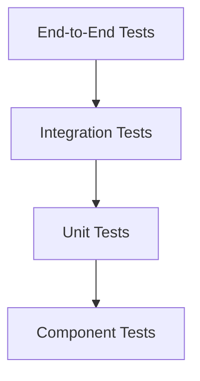

# Testing Guide

This document outlines the testing strategy and practices for the Kitchen 360° Organizer project.

## Testing Strategy

### Test Pyramid


### Coverage Goals
- Unit Tests: 80% minimum
- Integration Tests: 70% minimum
- End-to-End Tests: Critical paths only
- Performance Tests: Key metrics

## Testing Tools

### Core Tools
- Jest: Test runner and framework
- React Testing Library: Component testing
- Cypress: End-to-end testing
- MSW: API mocking
- Jest Performance: Performance testing

### Configuration
```javascript
// jest.config.js
module.exports = {
  preset: 'ts-jest',
  testEnvironment: 'jsdom',
  setupFilesAfterEnv: ['<rootDir>/jest.setup.js'],
  moduleNameMapper: {
    '^@/(.*)$': '<rootDir>/src/$1'
  },
  collectCoverageFrom: [
    'src/**/*.{ts,tsx}',
    '!src/**/*.d.ts',
    '!src/**/*.stories.{ts,tsx}'
  ]
};
```

## Unit Testing

### Component Testing
```typescript
import { render, screen, fireEvent } from '@testing-library/react';
import { Viewer } from './Viewer';

describe('Viewer', () => {
  it('renders correctly', () => {
    render(<Viewer imageUrl="test.jpg" />);
    expect(screen.getByRole('img')).toBeInTheDocument();
  });

  it('handles image load error', async () => {
    render(<Viewer imageUrl="invalid.jpg" />);
    const img = screen.getByRole('img');
    fireEvent.error(img);
    expect(screen.getByText('Failed to load image')).toBeInTheDocument();
  });
});
```

### Hook Testing
```typescript
import { renderHook, act } from '@testing-library/react-hooks';
import { useViewerState } from './useViewerState';

describe('useViewerState', () => {
  it('initializes with default state', () => {
    const { result } = renderHook(() => useViewerState());
    expect(result.current.isLoading).toBe(false);
  });

  it('updates state when loading image', () => {
    const { result } = renderHook(() => useViewerState());
    act(() => {
      result.current.loadImage('test.jpg');
    });
    expect(result.current.isLoading).toBe(true);
  });
});
```

## Integration Testing

### API Integration
```typescript
import { setupServer } from 'msw/node';
import { rest } from 'msw';
import { render, screen, waitFor } from '@testing-library/react';
import { ImageGallery } from './ImageGallery';

const server = setupServer(
  rest.get('/api/images', (req, res, ctx) => {
    return res(ctx.json([{ id: 1, url: 'test.jpg' }]));
  })
);

describe('ImageGallery', () => {
  beforeAll(() => server.listen());
  afterEach(() => server.resetHandlers());
  afterAll(() => server.close());

  it('loads and displays images', async () => {
    render(<ImageGallery />);
    await waitFor(() => {
      expect(screen.getByText('test.jpg')).toBeInTheDocument();
    });
  });
});
```

### State Integration
```typescript
import { render, screen } from '@testing-library/react';
import { ViewerProvider } from './ViewerContext';
import { ViewerControls } from './ViewerControls';

describe('ViewerControls', () => {
  it('updates viewer state', () => {
    render(
      <ViewerProvider>
        <ViewerControls />
      </ViewerProvider>
    );
    
    const zoomIn = screen.getByRole('button', { name: /zoom in/i });
    fireEvent.click(zoomIn);
    expect(screen.getByTestId('zoom-level')).toHaveTextContent('1.2');
  });
});
```

## End-to-End Testing

### Cypress Tests
```typescript
// cypress/integration/viewer.spec.ts
describe('Viewer', () => {
  it('loads and displays panorama', () => {
    cy.visit('/viewer');
    cy.get('[data-testid="viewer"]').should('be.visible');
    cy.get('[data-testid="loading"]').should('not.exist');
  });

  it('navigates between views', () => {
    cy.visit('/viewer');
    cy.get('[data-testid="next-view"]').click();
    cy.url().should('include', '/view/2');
  });
});
```

### Performance Testing

```typescript
// performance/viewer.spec.ts
describe('Viewer Performance', () => {
  it('loads within 2 seconds', () => {
    const start = performance.now();
    render(<Viewer imageUrl="large.jpg" />);
    const end = performance.now();
    expect(end - start).toBeLessThan(2000);
  });

  it('maintains 60fps during rotation', () => {
    const viewer = render(<Viewer imageUrl="test.jpg" />);
    const fps = measureFPS(() => {
      simulateRotation(viewer);
    });
    expect(fps).toBeGreaterThan(55);
  });
});
```

## Test Data Management

### Mock Data
```typescript
// __mocks__/data.ts
export const mockImages = [
  {
    id: '1',
    url: 'test1.jpg',
    name: 'Kitchen View 1',
    hotspots: []
  },
  {
    id: '2',
    url: 'test2.jpg',
    name: 'Kitchen View 2',
    hotspots: []
  }
];
```

### Fixtures
```typescript
// __fixtures__/viewer.ts
export const createViewerProps = (overrides = {}) => ({
  imageUrl: 'test.jpg',
  hotspots: [],
  onHotspotClick: jest.fn(),
  ...overrides
});
```

## Testing Best Practices

### Component Testing
- Test component behavior, not implementation
- Use data-testid for stable selectors
- Mock external dependencies
- Test edge cases and error states

### Integration Testing
- Test component interactions
- Verify state updates
- Check API integration
- Test error handling

### End-to-End Testing
- Test critical user journeys
- Verify navigation flows
- Check data persistence
- Test responsive behavior

## Continuous Integration

### GitHub Actions
```yaml
# .github/workflows/test.yml
name: Test
on: [push, pull_request]
jobs:
  test:
    runs-on: ubuntu-latest
    steps:
      - uses: actions/checkout@v2
      - uses: actions/setup-node@v2
      - run: npm install
      - run: npm test
      - run: npm run test:coverage
```

### Coverage Reporting
```yaml
# jest.config.js
module.exports = {
  coverageThreshold: {
    global: {
      branches: 80,
      functions: 80,
      lines: 80,
      statements: 80
    }
  }
};
```

## Debugging Tests

### Common Issues
- Async timing problems
- State management issues
- Mock setup errors
- Environment configuration

### Debugging Tools
- Jest debug mode
- React Testing Library debug()
- Cypress debugger
- Browser dev tools

## Performance Testing

### Metrics
- Load time
- Frame rate
- Memory usage
- Network requests

### Tools
- Lighthouse
- Web Vitals
- Performance API
- Chrome DevTools
