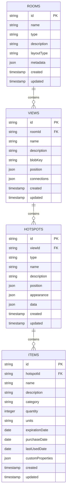
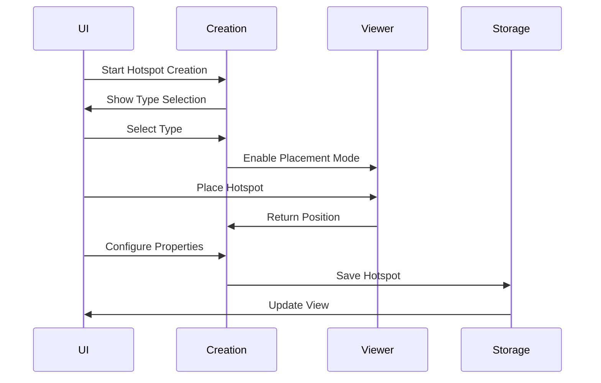
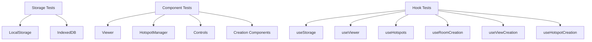

# Phase 1: Local Storage MVP

## Overview
This document outlines the implementation details for Phase 1 of the Kitchen 360° Organizer, focusing on creating a functional prototype with local storage and blob storage for images.

## Architecture Diagram


## Component Architecture

### Storage Layer


### State Management


### Viewer Integration


## Data Flow

### Image Loading


### Hotspot Management


## Implementation Details

### Storage Structure


### File Structure
```
src/
├── components/
│   ├── viewer/
│   │   ├── Viewer.tsx
│   │   ├── HotspotManager.tsx
│   │   └── Controls.tsx
│   ├── layout/
│   │   ├── AppBar.tsx
│   │   ├── Navigation.tsx
│   │   └── Modal.tsx
│   ├── creation/
│   │   ├── RoomCreation/
│   │   │   ├── RoomCreationStepper.tsx
│   │   │   ├── RoomDetailsStep.tsx
│   │   │   ├── InitialViewStep.tsx
│   │   │   └── StorageAreasStep.tsx
│   │   ├── ViewCreation/
│   │   │   ├── ViewCreationDialog.tsx
│   │   │   ├── ViewUploadStep.tsx
│   │   │   └── ViewConnectionsStep.tsx
│   │   └── HotspotCreation/
│   │       ├── HotspotCreationDialog.tsx
│   │       ├── HotspotTypeStep.tsx
│   │       ├── HotspotPlacementStep.tsx
│   │       ├── HotspotConfigStep.tsx
│   │       └── HotspotContentStep.tsx
│   └── common/
│       ├── Button.tsx
│       ├── Input.tsx
│       ├── Stepper.tsx
│       └── Dialog.tsx
├── hooks/
│   ├── useStorage.ts
│   ├── useViewer.ts
│   ├── useHotspots.ts
│   ├── useRoomCreation.ts
│   ├── useViewCreation.ts
│   └── useHotspotCreation.ts
├── services/
│   ├── storage/
│   │   └── IndexedDB.ts
│   └── viewer/
│       ├── ViewerService.ts
│       └── HotspotService.ts
├── types/
│   ├── Room.ts
│   ├── View.ts
│   ├── Hotspot.ts
│   └── Item.ts
└── context/
    ├── AppContext.tsx
    ├── ViewerContext.tsx
    ├── CreationContext.tsx
    └── HotspotContext.tsx
```

## New Features Implementation

### Room Creation Flow


### View Creation Flow


### Hotspot Creation Flow


## Performance Considerations

### Blob Management


### State Management


## Testing Strategy

### Unit Tests


### Integration Tests


## Next Steps
1. Set up project structure
2. Implement basic storage adapters
3. Create core viewer component
4. Implement room creation flow
5. Add view creation functionality
6. Add hotspot creation and management
7. Implement basic UI components
8. Set up testing infrastructure 