# Phase 2: Enhanced Browser Storage

## Overview
This document outlines the implementation details for Phase 2 of the Kitchen 360° Organizer, focusing on enhanced features while maintaining browser-native storage.

## Architecture Diagram

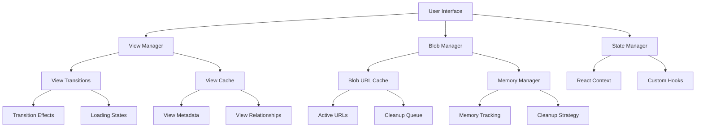

## Component Architecture

### View Management
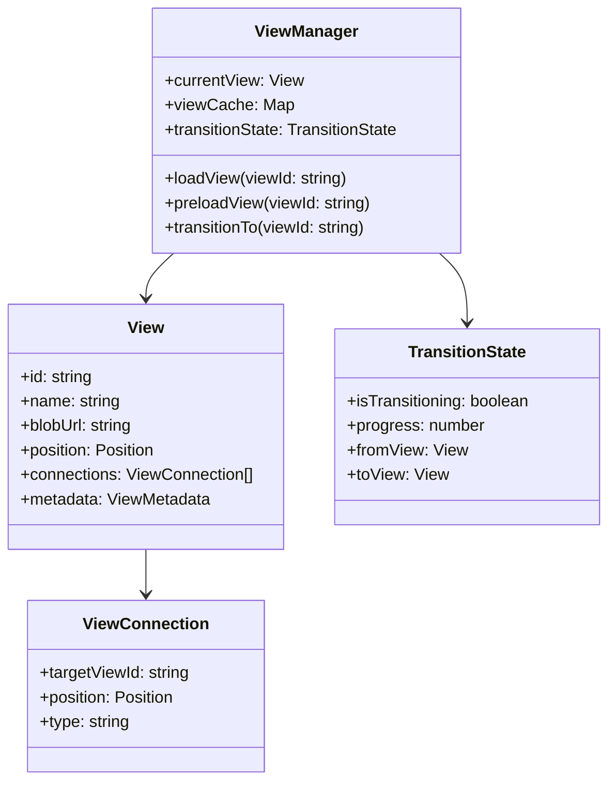

### Blob Management
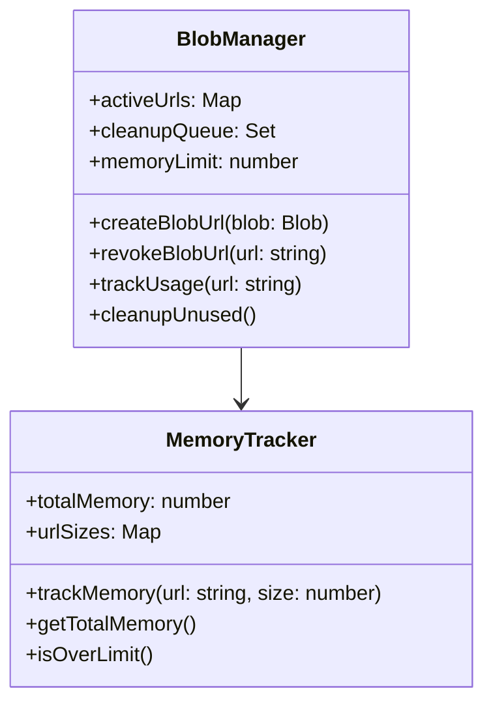

### Navigation System
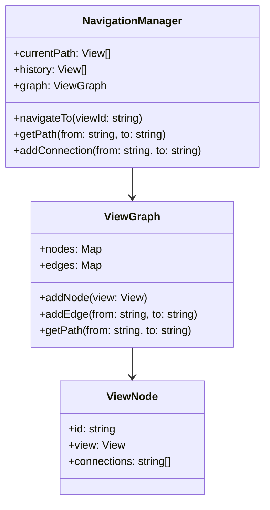

## Data Flow

### View Transition
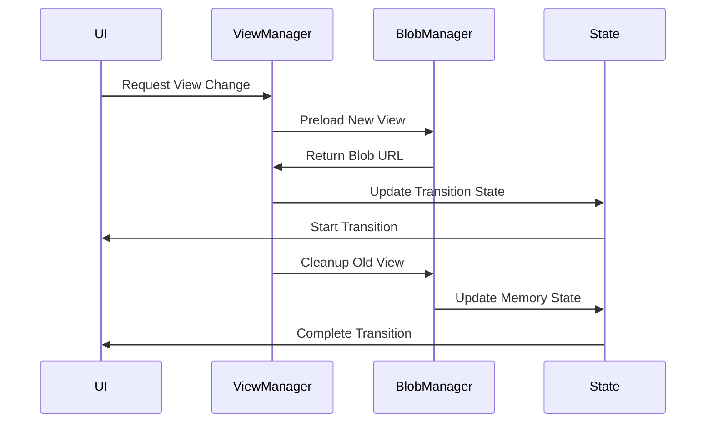

### Memory Management
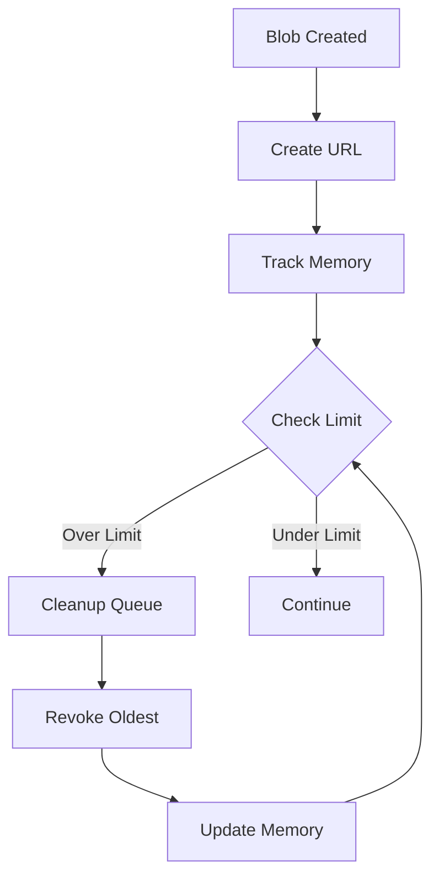

## Implementation Details

### View Cache Structure
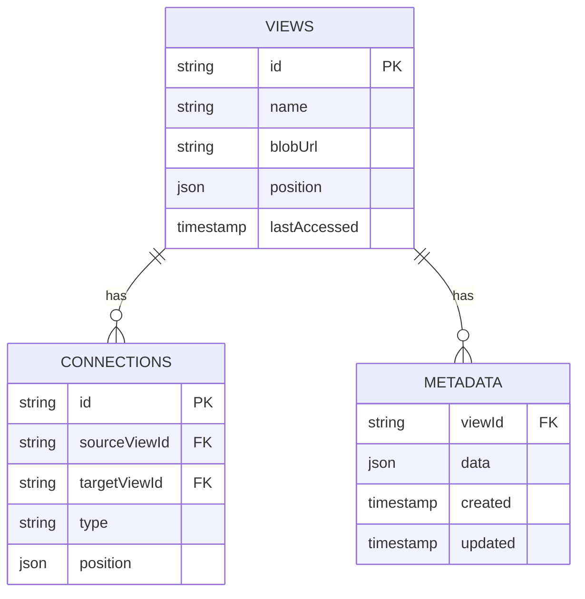

### File Structure
```
src/
├── components/
│   ├── viewer/
│   │   ├── ViewManager.tsx
│   │   ├── Transition.tsx
│   │   ├── Navigation.tsx
│   │   └── Controls.tsx
│   ├── layout/
│   │   ├── AppBar.tsx
│   │   ├── NavigationDrawer.tsx
│   │   └── Modal.tsx
│   └── common/
│       ├── Button.tsx
│       └── Input.tsx
├── hooks/
│   ├── useViewManager.ts
│   ├── useBlobManager.ts
│   ├── useNavigation.ts
│   └── useMemory.ts
├── services/
│   ├── view/
│   │   ├── ViewService.ts
│   │   └── TransitionService.ts
│   └── blob/
│       ├── BlobService.ts
│       └── MemoryService.ts
├── types/
│   ├── View.ts
│   ├── Connection.ts
│   └── Transition.ts
└── context/
    ├── ViewContext.tsx
    └── BlobContext.tsx
```

## Performance Considerations

### View Loading
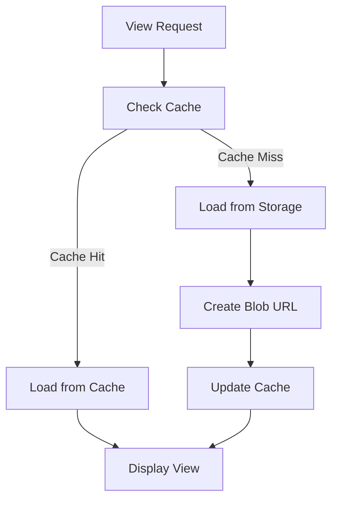

### Memory Management
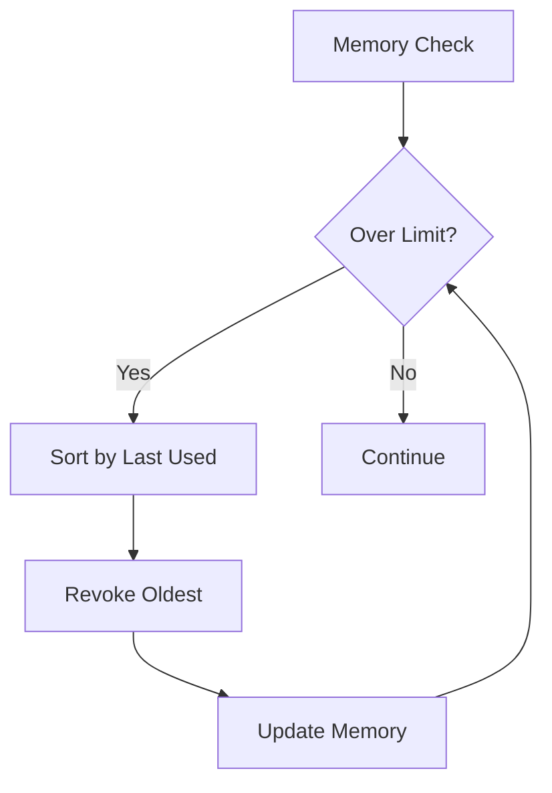

## Testing Strategy

### Unit Tests
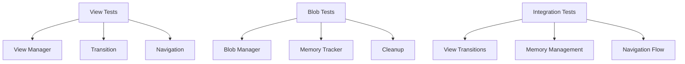

### Performance Tests
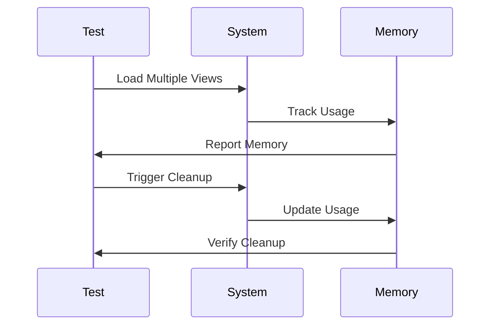

## Next Steps
1. Implement view transition system
2. Add blob URL caching
3. Create memory management system
4. Build navigation graph
5. Add view preloading
6. Implement cleanup strategies 