# GitHub Integration Implementation

## Overview
This document details the implementation of GitHub-based storage for the Kitchen 360° Organizer MVP.

## Architecture

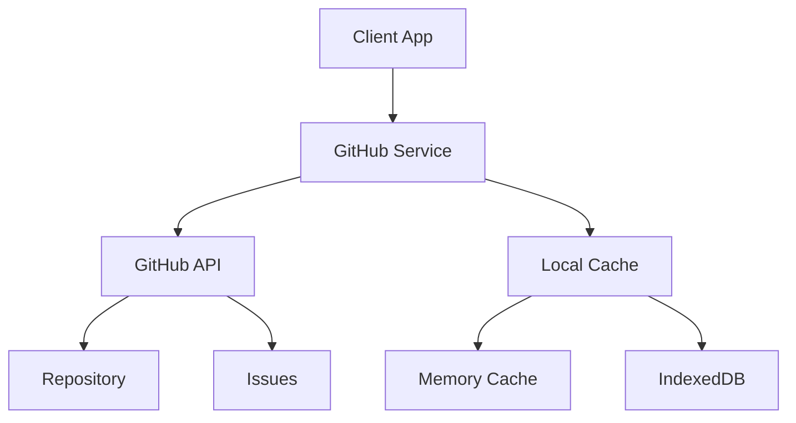

## Implementation Details

### GitHub Service
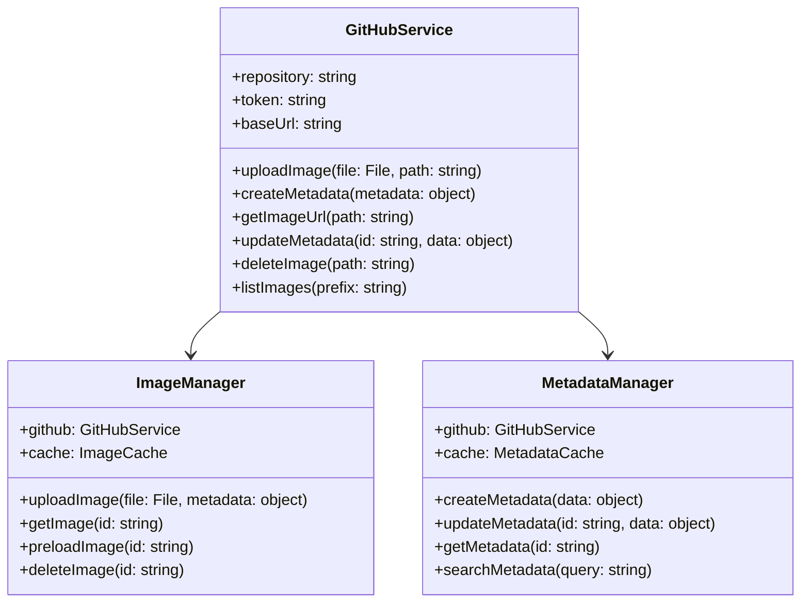

### Data Structures

#### Image Metadata
```typescript
interface ImageMetadata {
    id: string;
    name: string;
    path: string;
    size: number;
    type: string;
    createdAt: string;
    updatedAt: string;
    tags: string[];
    description?: string;
    position?: {
        latitude: number;
        longitude: number;
    };
}
```

#### GitHub Issue Template
```markdown
---
id: ${id}
type: image-metadata
path: ${path}
createdAt: ${timestamp}
updatedAt: ${timestamp}
---

# Image Metadata

## Details
- Name: ${name}
- Size: ${size}
- Type: ${type}

## Tags
${tags}

## Description
${description}

## Position
${position}
```

## API Integration

### Image Upload Flow
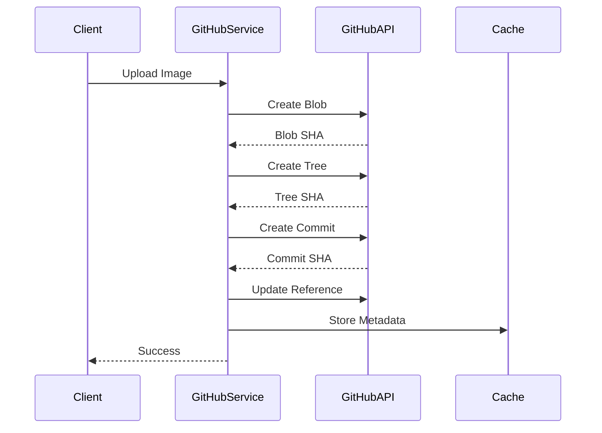

### Metadata Management
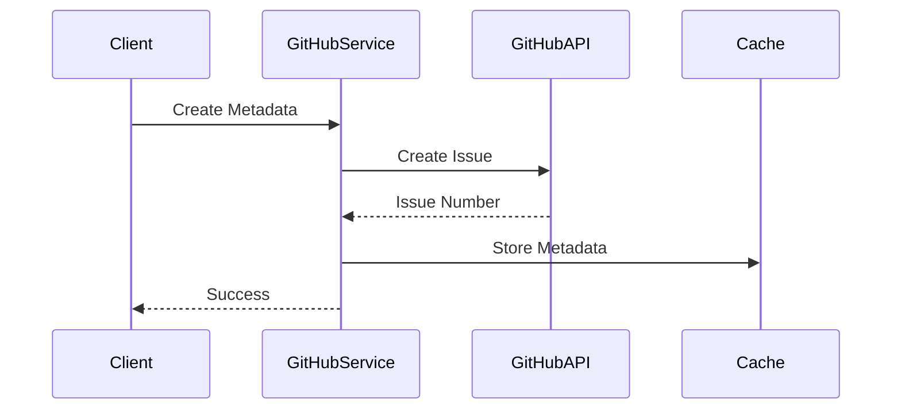

## Error Handling

### Error Types
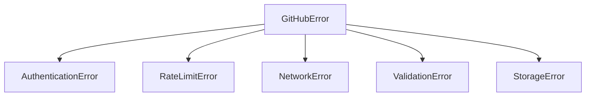

### Retry Strategy
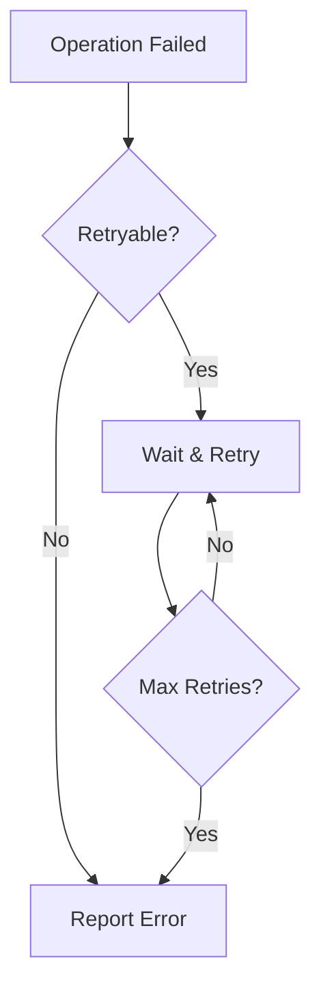

## Performance Optimization

### Caching Strategy
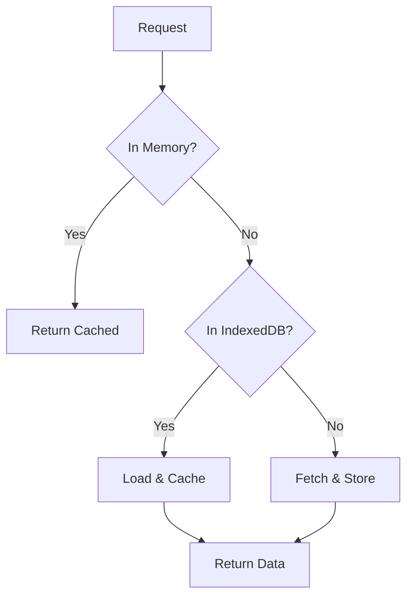

### Batch Operations
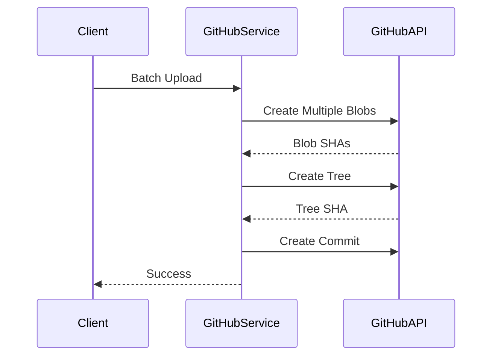

## Security

### Token Management
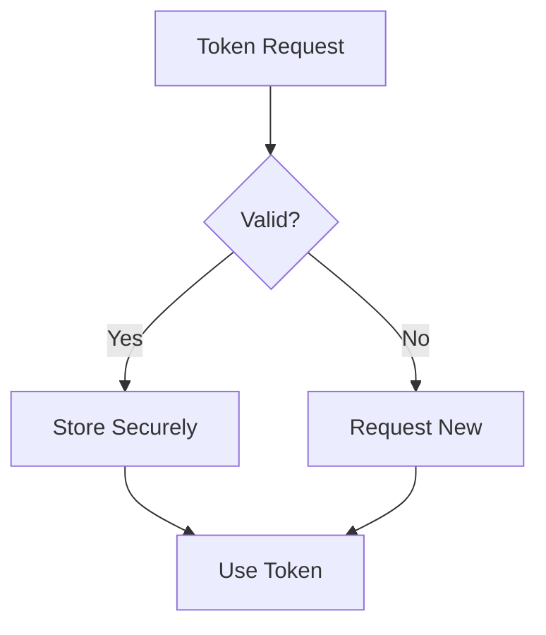

### Access Control
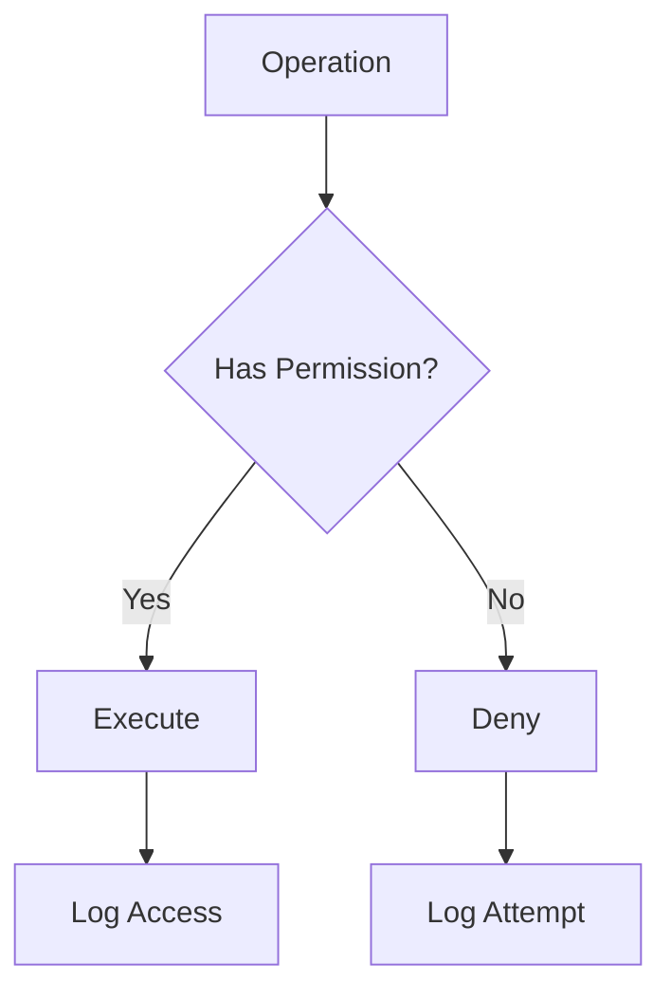

## Testing Strategy

### Unit Tests
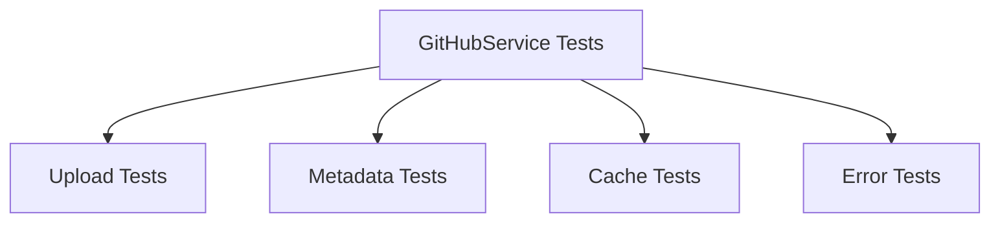

### Integration Tests
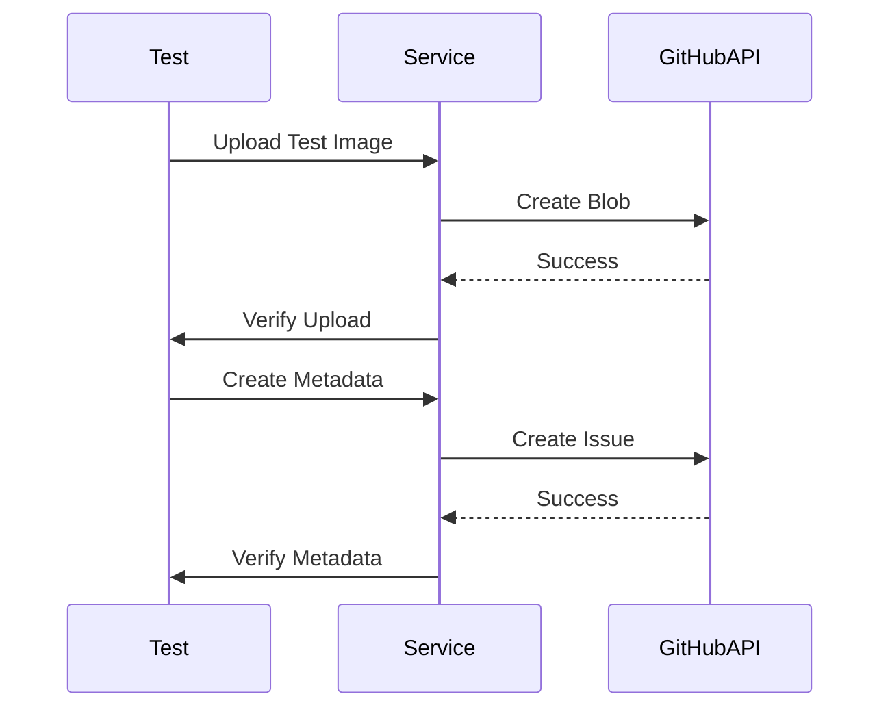

## Implementation Checklist
1. [ ] Set up GitHub API client
2. [ ] Implement image upload service
3. [ ] Create metadata management system
4. [ ] Implement caching layer
5. [ ] Add error handling
6. [ ] Set up security measures
7. [ ] Create test suite
8. [ ] Document API usage 