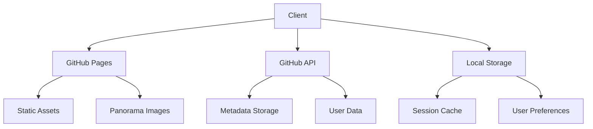
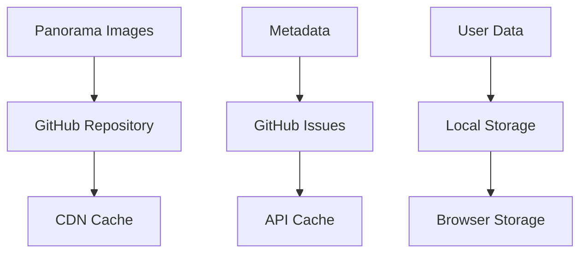
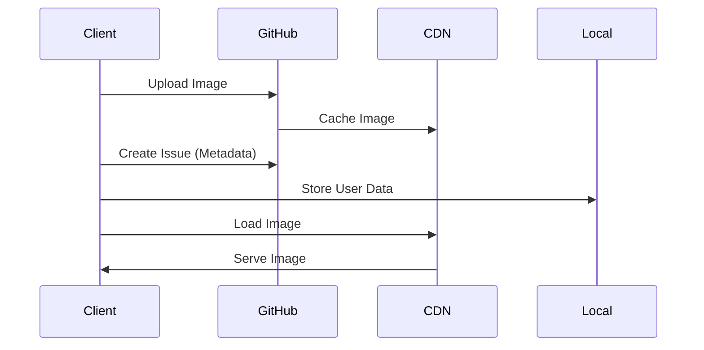
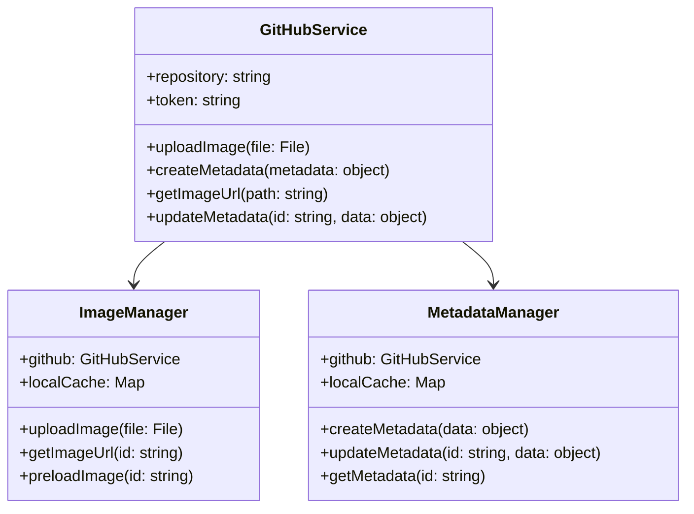
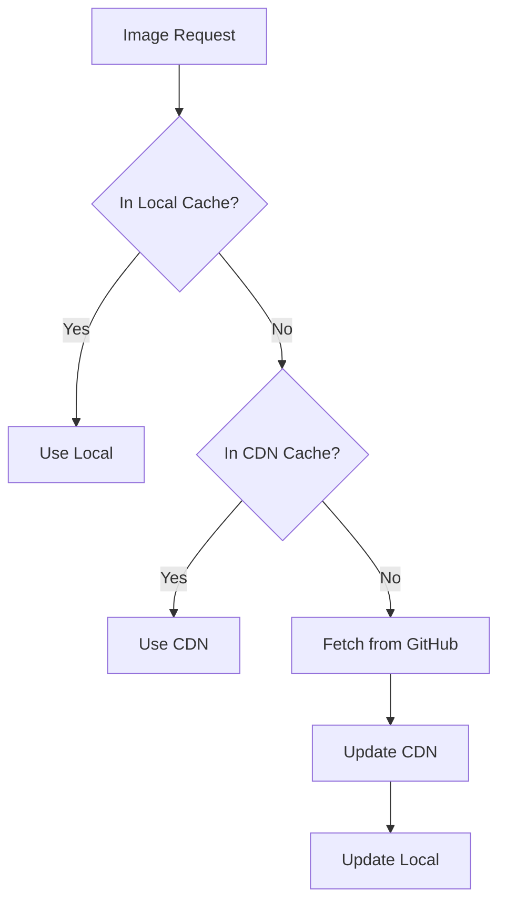
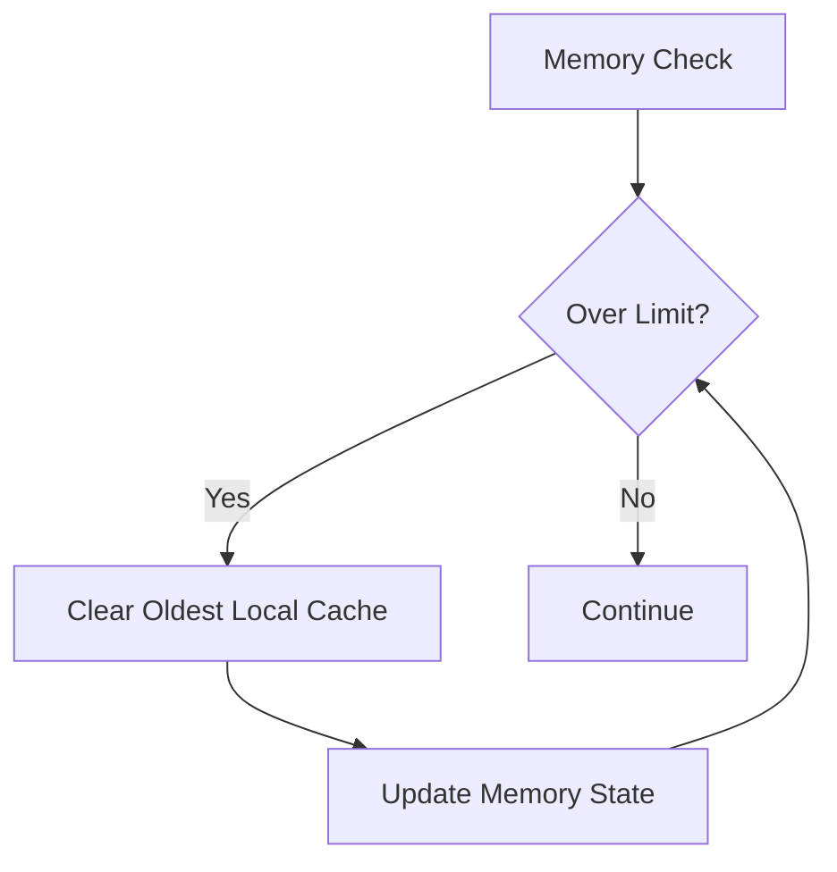
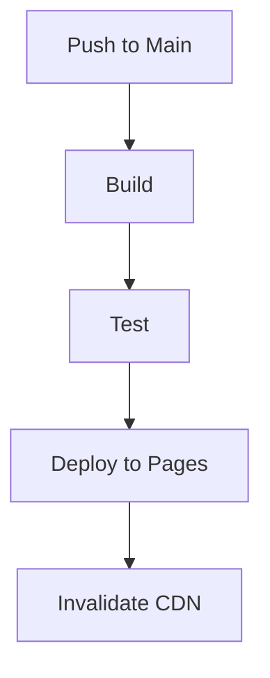
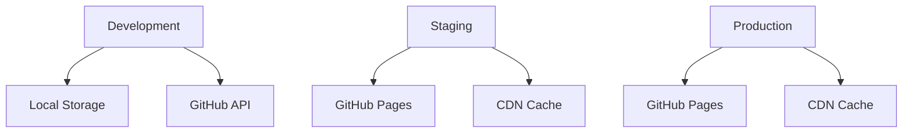
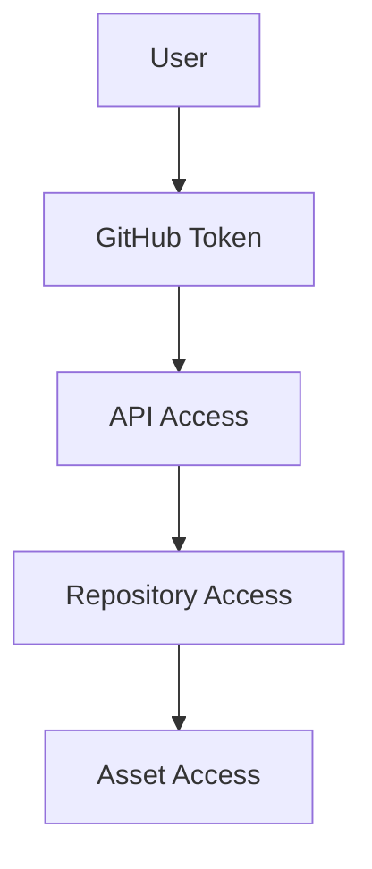
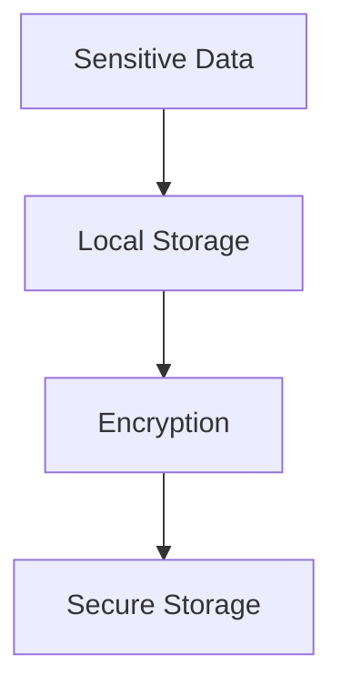

# Production Plan

## Overview
This document outlines the production strategy for the Kitchen 360° Organizer, focusing on a GitHub-based MVP approach that can scale to cloud storage later.

## Architecture Overview



## Storage Strategy

### Phase 1: GitHub-Based MVP


### Data Flow


## Implementation Details

### Repository Structure
```
kitchen-360/
├── public/
│   ├── images/
│   │   ├── panoramas/
│   │   └── thumbnails/
│   └── assets/
├── src/
│   ├── components/
│   ├── services/
│   └── utils/
└── docs/
```

### GitHub Integration


## Performance Optimization

### Caching Strategy


### Memory Management


## Deployment Pipeline

### GitHub Actions Workflow


### Environment Setup


## Security Considerations

### Access Control


### Data Protection


## Migration Path to Cloud Storage

### Phase 1: GitHub MVP
- Store images in GitHub repository
- Use GitHub Issues for metadata
- Local storage for user data

### Phase 2: Hybrid Approach
- Keep GitHub for static assets
- Add cloud storage for new uploads
- Dual storage system

### Phase 3: Full Cloud
- Migrate all assets to cloud storage
- Update metadata storage
- Remove GitHub dependency

## Next Steps
1. Set up GitHub repository structure
2. Implement GitHub API integration
3. Create deployment pipeline
4. Set up CDN configuration
5. Implement caching system
6. Create migration scripts 